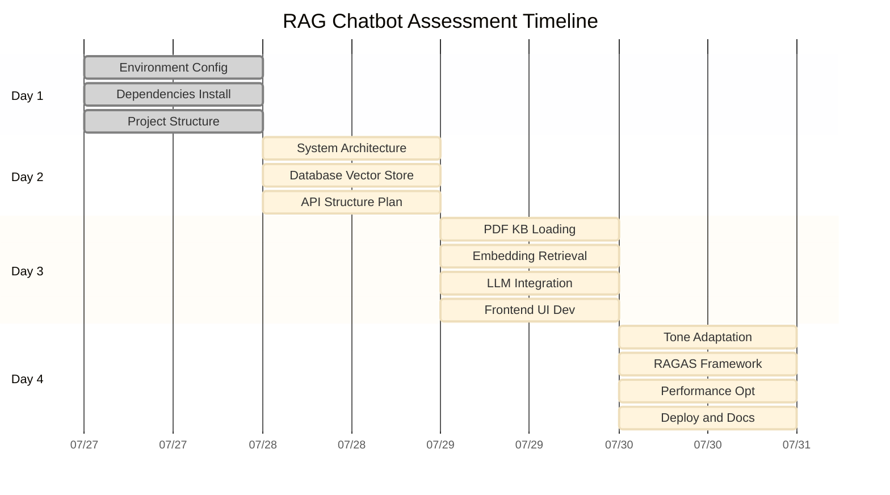

# RAG Chatbot Assessment - Project Plan

## Gantt Chart

## Project Overview

This Gantt chart outlines the development timeline for the RAG Chatbot Assessment, spanning 4 intensive days from July 27-30, 2025.

### Key Phases:

1. **Day 1: Project Setup (July 27)**
   - Environment configuration and dependencies
   - Project structure scaffolding
   - Initial setup completion

2. **Day 2: Architecture Design and Setup (July 28)**
   - System architecture design
   - Database and vector store configuration
   - API structure planning

3. **Day 3: RAG Implementation and UI (July 29)**
   - PDF knowledge base processing
   - Embedding and retrieval system implementation
   - LLM integration and frontend UI development

4. **Day 4: Improvement and Deployment (July 30)**
   - Primary school tone adaptation
   - RAGAS evaluation framework implementation
   - Performance optimization and deployment

### Success Criteria:
- RAGAS scores >80% on faithfulness, answer relevancy, context precision, and context recall
- Primary school appropriate tone and language
- Proper scope limitation with fallback responses
- Complete documentation and working deployment