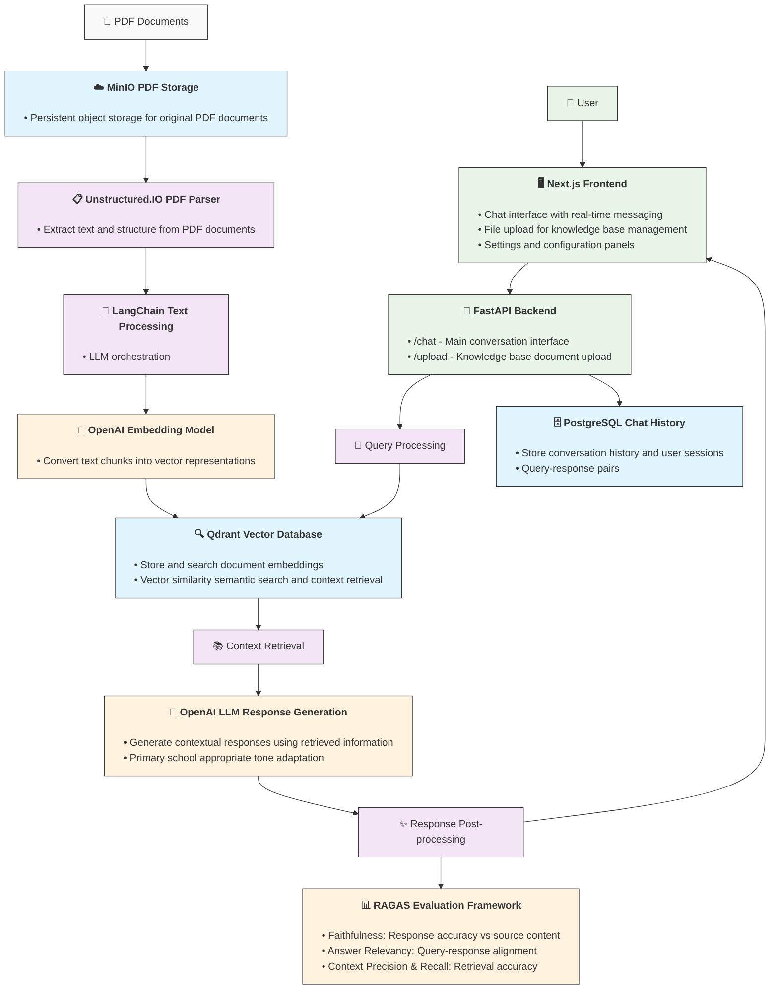

# System Design - RAG Chatbot

## Architecture Overview




## Data Flow

### 1. Knowledge Base Ingestion
```
PDF Upload → MinIO Storage → Unstructured.IO → LangChain Chunking → 
OpenAI Embeddings → Qdrant Storage
```

### 2. Query Processing
```
User Query → FastAPI → Query Processing → Qdrant Search → 
Context Retrieval → OpenAI LLM → Response Generation → 
PostgreSQL Logging → Frontend Display
```

### 3. Evaluation Loop
```
Generated Response → RAGAS Evaluation → Metrics Storage → 
Performance Monitoring → System Optimization
```
